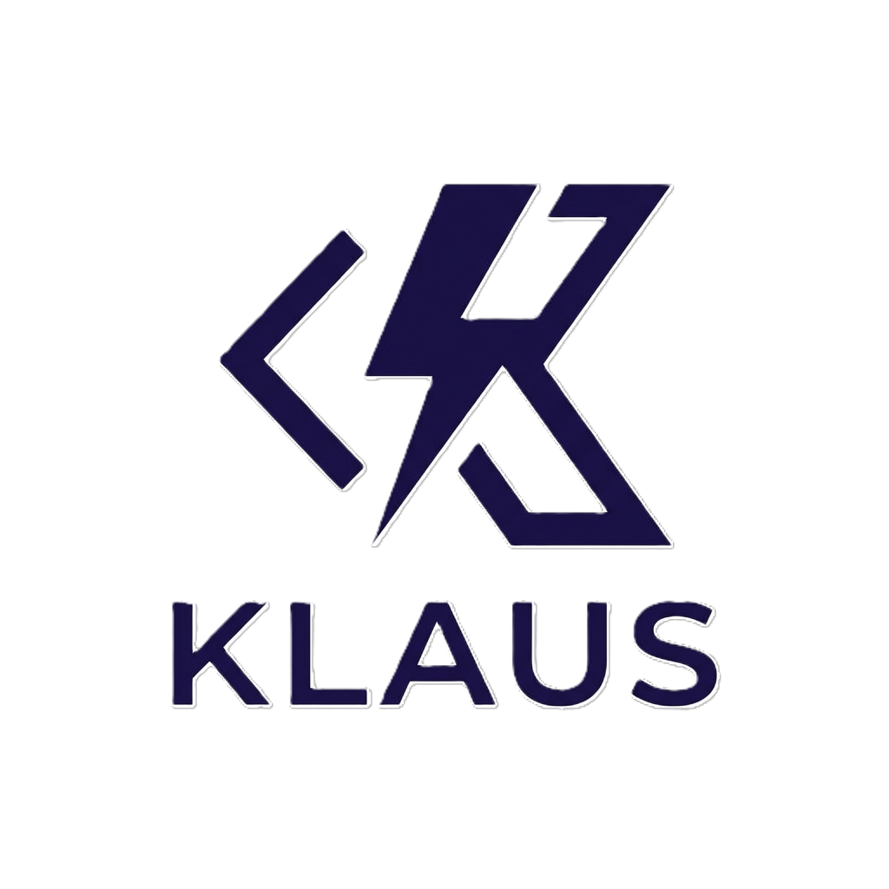

#  Klaus AI - Intelligent Coding Assistant

Klaus is an advanced AI-powered coding assistant extension for Visual Studio Code, designed and developed by **Maepl Labs** and inspired by the **Wingman-ai** project. It combines intelligent code completion, autonomous coding capabilities, and an interactive chat interface to enhance developer productivity and code quality.

## Overview

Klaus integrates seamlessly into your VS Code workflow, providing context-aware assistance for coding tasks, refactoring, documentation generation, and complex multi-file operations. Built on the core intelligence that achieved a **70% success rate** on the **SWE-bench Verified** benchmark, Klaus brings professional-grade agentic performance to your local environment. It adapts to your development workflow with support for multiple AI providers and extensibility through the Model Context Protocol (MCP).

## Core Features

### Intelligent Code Assistance

Klaus provides real-time, context-aware code suggestions and completions:

- Inline code completion with intelligent suggestions based on your codebase
- Smart refactoring capabilities that understand code structure and patterns
- Automatic documentation generation for functions, classes, and modules
- Real-time code analysis with actionable quick fixes
- Semantic understanding of your project's architecture

### Interactive Chat Interface

Engage with Klaus through a natural language interface:

- Multi-turn conversations with full context retention
- Thread management for organizing different coding sessions
- File-aware responses with deep codebase understanding
- Reference specific files using @ mentions
- Image support for visual context (diagrams, screenshots, UI mockups)
- Diagnostic integration showing code issues and suggestions

### Composer Mode

An autonomous coding agent capable of complex, multi-step operations:

- Multi-file editing with coordinated changes across your codebase
- **Sequential Thinking**: Analytical problem-solving that reflects on multiple root causes before implementation
- **Reproduction Scripts**: Autonomous verification of bugs and fixes through custom test scripts
- Command execution for build, test, and deployment operations
- Git integration for version control operations
- Autonomous problem-solving with tool usage
- Review and approval workflow for proposed changes

### Advanced Capabilities

- Semantic code search powered by LanceDB vector embeddings
- Intelligent code retrieval for relevant context
- Model Context Protocol (MCP) support for custom tools and data sources
- Web search integration for up-to-date information
- File inspection with diagnostic analysis
- Background process management

## Supported AI Providers

Klaus supports multiple AI providers, giving you flexibility in choosing your preferred model:

- **OpenAI**: GPT-4, GPT-4 Turbo, GPT-3.5 Turbo
- **Anthropic**: Claude 3.7 Sonnet, Claude 3.5 Haiku, Claude 3 Opus
- **Google**: Gemini Pro, Gemini Flash, Gemini Pro Vision
- **Azure AI**: Azure OpenAI Service with custom deployments
- **xAI**: Grok models
- **OpenRouter**: Access to multiple models through a unified API
- **Ollama**: Local model hosting for privacy and offline use
- **LMStudio**: Local model hosting with custom configurations

## Installation

### Prerequisites

- Visual Studio Code version 1.95.0 or higher
- Node.js version 18.x or higher
- API key from at least one supported AI provider

### From Source

1. Clone the repository:

```bash
git clone https://github.com/MaeplLabs/klaus-ai.git
cd klaus-ai
```

2. Install dependencies:

```bash
npm install
```

3. Build the extension:

```bash
npm run compile
```

4. Launch the extension in development mode:

Open the project in VS Code and press F5 to start the Extension Development Host.

## Configuration

### Initial Setup

1. Open Klaus settings by clicking the Klaus icon in the VS Code activity bar
2. Select your preferred AI provider from the dropdown
3. Enter your API key securely (stored in VS Code's secret storage)
4. Configure model preferences for chat and code completion
5. Adjust interaction settings to match your workflow

### AI Provider Configuration

Each provider has specific configuration options:

- **API Keys**: Securely stored and never exposed in logs
- **Model Selection**: Choose specific models for different tasks
- **Base URLs**: Configure custom endpoints for self-hosted or enterprise deployments
- **Temperature**: Control response creativity and determinism
- **Max Tokens**: Set limits for response length

### Embedding Provider Configuration

Configure semantic search capabilities:

- Select an embedding provider (OpenAI, Azure, Google, Ollama, LMStudio, OpenRouter)
- Configure embedding model and dimensions
- Index your workspace for semantic search
- Monitor indexed files in the settings panel

### Agent Features

Customize Klaus's autonomous capabilities:

- **Vibe Mode**: Enable experimental features and enhanced creativity
- **Tool Access**: Control which tools Klaus can use
- **Approval Workflow**: Require manual approval for file changes
- **Command Execution**: Allow or restrict shell command execution

### Custom Rules

Create a `.klausrules` file in your project root to define project-specific guidelines:

```
# Project-specific rules for Klaus

## Code Style
- Use TypeScript strict mode
- Follow ESLint configuration
- Prefer functional components in React
- Use async/await over promises

## Architecture
- Follow clean architecture principles
- Separate business logic from UI components
- Use dependency injection

## Testing
- Write unit tests for all business logic
- Use integration tests for API endpoints
- Maintain test coverage above 80%
```

## Usage

### Code Completion

Klaus provides intelligent inline suggestions as you type:

- Automatic triggering based on context
- Manual trigger with `Ctrl+Shift+Space` (Windows/Linux) or `Cmd+Shift+Space` (Mac)
- Multi-line completions for complex code blocks
- Context-aware suggestions based on surrounding code

### Chat Interface

Access the chat interface through the Klaus icon in the activity bar:

1. Type your question or request in the chat input
2. Reference specific files using @ mentions (e.g., @filename.ts)
3. Attach images by pasting or using the attachment button
4. View diagnostic suggestions for code issues
5. Organize conversations using threads

### Composer Mode

Open the Composer with `Ctrl+I` (Windows/Linux) or `Cmd+I` (Mac):

1. Describe the changes you want to make in natural language
2. Klaus analyzes your codebase and proposes modifications
3. Review proposed changes in a diff view
4. Accept or reject individual file modifications
5. Klaus executes approved changes and reports results

### Quick Actions

Access Klaus features through context menus:

- **Generate Documentation**: Right-click on a function or class
- **Refactor Code**: Select code and choose refactoring options
- **Quick Fix**: Click on diagnostics for AI-powered fixes
- **Explain Code**: Get natural language explanations of complex code

## Model Context Protocol (MCP)

Klaus supports MCP for extending functionality with custom tools and data sources.

### Configuration

Create a `.klaus/mcp.json` file in your workspace:

```json
{
  "mcpServers": {
    "filesystem": {
      "command": "npx",
      "args": [
        "-y",
        "@modelcontextprotocol/server-filesystem",
        "/path/to/allowed/files"
      ]
    },
    "database": {
      "command": "node",
      "args": ["./mcp-servers/database-server.js"]
    }
  }
}
```

### Available MCP Servers

Klaus automatically discovers and integrates MCP servers:

- Filesystem access with controlled permissions
- Database query capabilities
- API integration tools
- Custom business logic tools

## Privacy and Security

Klaus is designed with privacy and security as core principles:

- **Local Processing**: Code analysis happens locally when possible
- **Secure Storage**: API keys stored in VS Code's encrypted secret storage
- **No Data Collection**: No telemetry or usage data sent to external servers
- **Controlled Access**: Workspace trust controls file system operations
- **Audit Trail**: All AI interactions can be logged for review

## Development

### Project Structure

```
klaus-ai/
├── src/                    # Extension source code
│   ├── composer/          # Autonomous agent implementation
│   │   ├── tools/        # Agent tools (file operations, search, etc.)
│   │   └── checkpointer/ # State management
│   ├── providers/         # VS Code providers
│   │   ├── completion/   # Code completion provider
│   │   └── chat/         # Chat interface provider
│   ├── service/           # Core services
│   │   ├── settings/     # Settings management
│   │   └── anthropic/    # AI provider implementations
│   ├── server/            # Language server
│   │   ├── files/        # File parsing and analysis
│   │   └── retriever/    # Context retrieval
│   └── extension.ts       # Extension entry point
├── views-ui/              # React-based UI components
│   ├── src/App/          # Chat interface
│   ├── src/Config/       # Settings interface
│   └── src/Diff/         # Diff viewer
├── shared/                # Shared types and utilities
└── out/                   # Compiled output
```

### Building

Build the extension and UI components:

```bash
# Build extension
npm run build

# Build UI components
npm run build:views

# Build everything
npm run compile

# Watch mode for development
npm run watch
```

### Testing

Run the test suite:

```bash
npm test
```

### Debugging

1. Open the project in VS Code
2. Press F5 to launch the Extension Development Host
3. Set breakpoints in the source code
4. Use the Debug Console for logging and inspection

## Contributing

Contributions are welcome and appreciated. Please follow these guidelines:

1. Fork the repository
2. Create a feature branch
3. Make your changes with clear commit messages
4. Add tests for new functionality
5. Ensure all tests pass
6. Submit a pull request with a detailed description

## License

This project is licensed under the MIT License. See the LICENSE file for details.

## Support

For issues, questions, or feature requests:

- GitHub Issues: [Report bugs and request features](https://github.com/MaeplLabs/klaus-ai/issues)
- Documentation: Visit https://docs.maepllabs.com
- Contact: Reach out to Maepl Labs for enterprise support

## Acknowledgments

Klaus is built on top of excellent open-source projects:

- **LangChain**: AI orchestration and agent framework
- **LanceDB**: High-performance vector database
- **VS Code Extension API**: Extensibility platform
- **React**: UI component library
- **TypeScript**: Type-safe development

Special thanks to the open-source community for their contributions and support.

---

Developed by **Maepl Labs**. Inspired by the vision and architecture of **Wingman-ai**.
